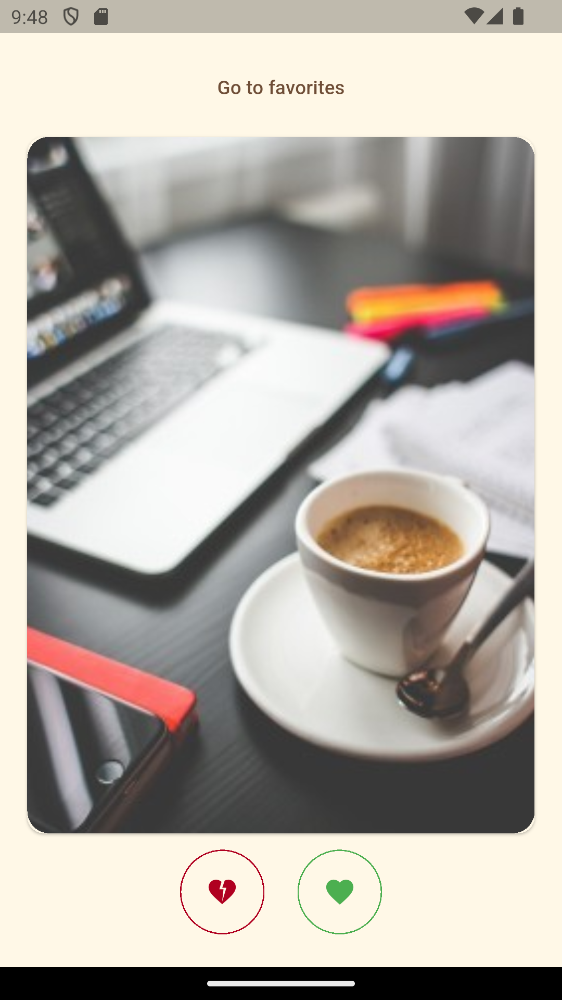
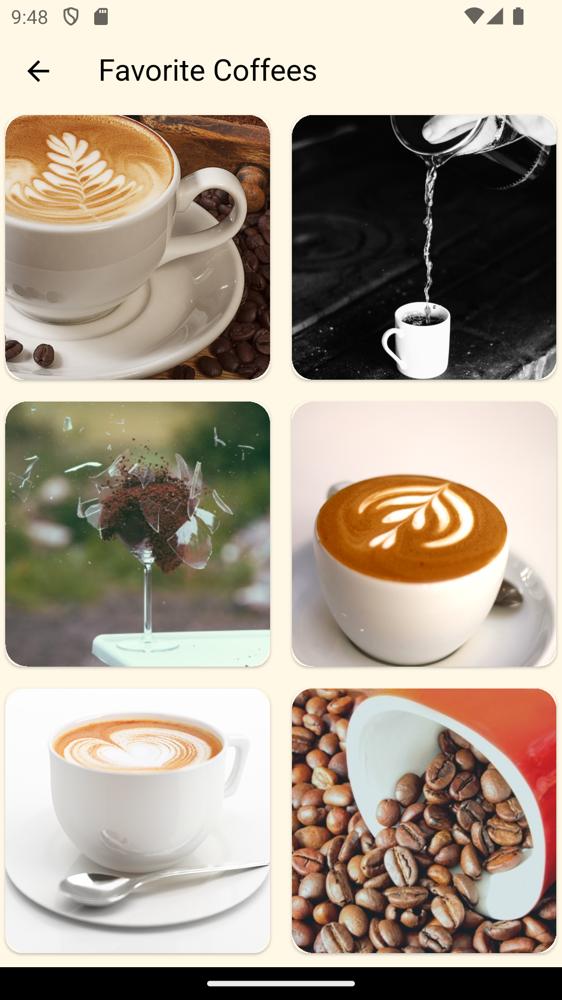
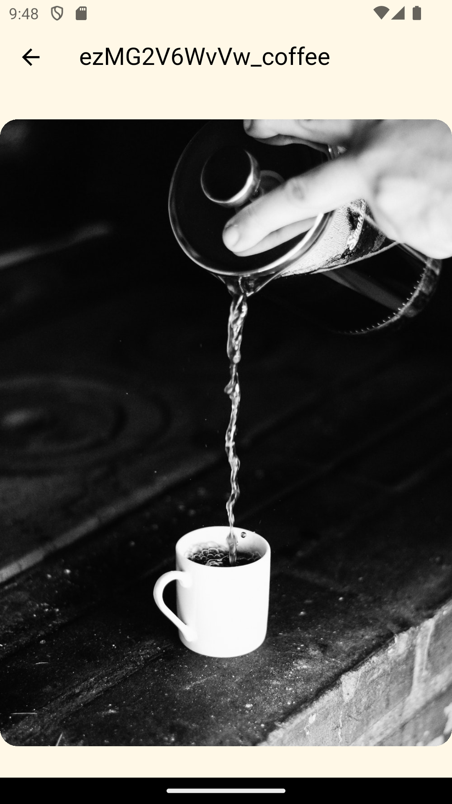

# Fav Coffee

![coverage][coverage_badge]
[![style: very good analysis][very_good_analysis_badge]][very_good_analysis_link]
[![License: MIT][license_badge]][license_link]

Generated by the [Very Good CLI][very_good_cli_link] 🤖

A Very Good Project created by Very Good CLI.

This project creates an application for coffee lovers to select and save their favorite coffee images from the https://coffee.alexflipnote.dev/ API.

---

## Running the application 🚀

Run the below command to generate the translations:

`flutter gen-l10n --arb-dir="lib/l10n/arb"`

This project contains 3 flavors, but there are no differences between them yet:

- development
- staging
- production

To run the desired flavor either use the launch configuration in VSCode/Android Studio or use the following commands:

```sh
# Development
$ flutter run --flavor development --target lib/main_development.dart

# Staging
$ flutter run --flavor staging --target lib/main_staging.dart

# Production
$ flutter run --flavor production --target lib/main_production.dart
```

_\*Fav Coffee works on iOS ans Android._

---

## App Pages

| Random Coffee | Favorite coffees list | Favorite Coffee Details |
| --- | --- | --- |
|  |  | 

[coverage_badge]: coverage_badge.svg
[flutter_localizations_link]: https://api.flutter.dev/flutter/flutter_localizations/flutter_localizations-library.html
[internationalization_link]: https://flutter.dev/docs/development/accessibility-and-localization/internationalization
[license_badge]: https://img.shields.io/badge/license-MIT-blue.svg
[license_link]: https://opensource.org/licenses/MIT
[very_good_analysis_badge]: https://img.shields.io/badge/style-very_good_analysis-B22C89.svg
[very_good_analysis_link]: https://pub.dev/packages/very_good_analysis
[very_good_cli_link]: https://github.com/VeryGoodOpenSource/very_good_cli
